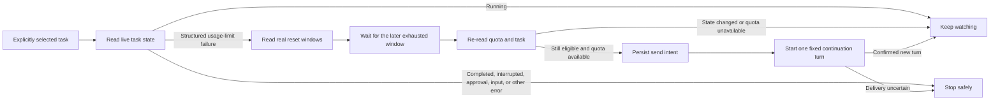

<p align="center">
  
</p>

<h1 align="center">Codex Auto Resume</h1>

<p align="center">
  <strong>Let long-running Codex tasks continue after your usage limit naturally resets.</strong>
</p>

<p align="center">
  A local, safety-first companion for one explicitly selected task in the Codex desktop app.
</p>

<p align="center">
  <a href="https://github.com/progressrdx/codex-auto-resume/actions/workflows/ci.yml"></a>
  
  
  
  
  <a href="LICENSE"></a>
  <a href="https://github.com/progressrdx/codex-auto-resume/stargazers"></a>
</p>

<p align="center">
  <a href="README.zh-CN.md">简体中文</a> ·
  <a href="#quick-start">Quick Start</a> ·
  <a href="#how-it-works">How it works</a> ·
  <a href="#safety-model">Safety</a> ·
  <a href="#faq">FAQ</a>
</p>

---

When a long Codex task hits a usage limit, the work can stop even though the task itself is unfinished. Codex Auto Resume watches one task you explicitly choose, waits for the real usage window to reset, re-checks the task, and starts the next turn in the original conversation.

It does **not** switch accounts, buy credits, redeem resets, approve tool calls, create replacement conversations, or take over every unfinished task.

> [!IMPORTANT]
> This is an experimental, unofficial companion project and is not affiliated with or endorsed by OpenAI. The project owner has completed two successful real-account end-to-end runs across natural usage reset boundaries. See [Current validation status](#current-validation-status) for the tested scope and remaining limitations.

## Preview

<p align="center">
  
</p>

<p align="center"><sub>The screenshot uses isolated synthetic data. It contains no account or conversation information.</sub></p>

## Why this project

- **Continue in the original task** — preserve the conversation, model, reasoning settings, permissions, and working directory.
- **Local by design** — no hosted backend, domain, cloud database, or separate tool account.
- **One task at a time** — the user explicitly selects the task; titles and “latest task” guesses are never enough to authorize monitoring.
- **Fail closed** — normal completion, approval prompts, user input, unsupported App versions, and uncertain delivery stop automation.
- **Persistent safeguards** — budgets, cancellation, process locks, and deduplication survive restarts.
- **UI and CLI** — use the local browser dashboard or the same guarded commands directly.
- **No runtime packages** — the product uses only Python's standard library.

## Quick Start

### Requirements

- macOS, or Windows 11 (Windows support is currently a preview)
- Python 3.9 or newer
- The Codex desktop app installed, signed in, and kept open
- Verified macOS App version: `26.820.60940 / build 7119`
- Currently adapted Windows versions: App `26.901.31953.0`, CLI `0.153.1`
- Default path: macOS `/Applications/ChatGPT.app`; Windows `%LOCALAPPDATA%\OpenAI\Codex\bin\codex.exe`

Run the Windows preview from native PowerShell or Command Prompt, not from inside WSL. This helper connects to the native Windows Codex App named pipe. The Codex Windows App itself supports native Windows and optional WSL workspaces, but those are different execution environments.

Unsupported App versions are rejected instead of silently using an unverified internal protocol.

### Let Codex start it for you (recommended for beginners)

After cloning the repository, open the `codex-auto-resume` folder as a project in the Codex desktop app, create a task in that project, and paste this prompt:

```text
Read README.md, AGENTS.md, and .agents/skills/codex-auto-resume/SKILL.md first.
Check that this computer meets the requirements. Use ./resume on macOS and
.\resume.cmd on Windows. Run doctor first; if the read-only check succeeds,
run web and keep the local server running.
Tell me the exact dashboard URL and the connection credential printed by that
same server process. Do not select, start, stop, or manage any Codex task until
I explicitly choose one exact task.
```

Codex can run the checks and start the local server. Depending on your Codex permission settings, it may ask you to approve the terminal commands. Review the command and approve only the project-local operation you expect.

When startup succeeds, Codex will report output similar to:

```text
控制台地址：http://127.0.0.1:8765/
连接凭据：Jr7...the rest of this run's random value
```

Open the dashboard URL in a browser on the same computer, paste that credential, and click **连接**. The credential is created locally by `./resume web` (or `.\resume.cmd web` on Windows); it is **not** an OpenAI API key, ChatGPT password, Codex account token, or GitHub token. You do not obtain it from any website or account settings.

> [!NOTE]
> A new random credential is generated every time the Web server starts. It is printed only in that server's terminal output and works only while that process is running. Restarting `./resume web` invalidates the old value. If it is accidentally exposed, stop the Web server with `Control-C` and start it again to rotate the credential.

After the dashboard is connected, you can ask Codex to discover tasks without enrolling any of them:

```text
Run the list command for this system (./resume list on macOS or .\resume.cmd list
on Windows) and show me the available local Codex tasks. Do not enroll
anything. I will choose the exact task first.
```

After you choose one exact task, ask Codex to check it. Starting monitoring is a separate action and requires your explicit confirmation:

```text
Run the read-only check for task <TASK_UUID> and explain the result. Do not
start monitoring yet.
```

If the result contains `canMonitor: true` and you want to proceed:

```text
Start monitoring only task <TASK_UUID> with the default cumulative resume
budget. Do not manage any other task and do not approve requests for me.
```

You can also select and confirm the same task yourself in the dashboard. Codex Auto Resume never treats discovery or a successful read-only check as permission to start monitoring.

### Manual setup

#### 1. Clone

```bash
git clone https://github.com/progressrdx/codex-auto-resume.git
cd codex-auto-resume
```

#### 2. Check the local connection

macOS:

```bash
./resume doctor
```

Windows (PowerShell or Command Prompt):

```powershell
.\resume.cmd doctor
```

`doctor` is read-only. It checks the App version, local connection, and usage windows without running a model or selecting a task.

#### 3. Start the local dashboard

macOS:

```bash
./resume web
```

Windows:

```powershell
.\resume.cmd web
```

The terminal prints a local URL and a new random connection credential. This credential is generated by the local process at startup; it does not come from OpenAI, ChatGPT, Codex, or GitHub:

```text
控制台地址：http://127.0.0.1:8765/
连接凭据：<random credential for this run>
```

Open the URL on the same computer and paste the credential into the page. Copy it from the terminal running the Web server (or from Codex's report of that exact terminal output). The server only listens on `127.0.0.1`; it is not exposed to your LAN or the internet.

## Using the dashboard

1. Connect with the credential printed by `./resume web`.
2. Review the five-hour and weekly usage windows.
3. Choose **托管长任务** and select one local Codex conversation.
4. Let the read-only check confirm whether that exact task can be monitored.
5. Review the cumulative resume budget—the default maximum is 3—and confirm enrollment.
6. Use **停止监控** whenever you want to cancel future continuations.

Stopping monitoring does not interrupt work already running in Codex and cannot retract a message already accepted by the App. Closing the browser or the Web server also does not stop an already launched watcher.

## CLI usage

The dashboard calls the same guarded entry point. You can use it directly:

The examples below use macOS's `./resume`. On Windows, replace that prefix with `.\resume.cmd`; all remaining arguments are identical.

```bash
# Discover local conversations; this does not enroll them.
./resume list

# Read-only eligibility check for one exact UUID.
./resume check <TASK_UUID>

# Start one watcher with the default cumulative budget of 3.
./resume start <TASK_UUID>

# Inspect persisted watcher records.
./resume status

# Cancel future continuations for that task.
./resume stop <TASK_UUID>
```

To deliberately choose a different cumulative limit:

```bash
./resume start <TASK_UUID> --max-resumes 5
```

If the account reports more than one usage bucket, specify the intended bucket explicitly:

```bash
./resume start <TASK_UUID> --limit-id codex
```

The tool never guesses between multiple buckets.

## How it works



The continuation text is fixed in the source. The Web API cannot submit an arbitrary prompt, shell command, App RPC method, approval decision, or account mutation.

## What triggers a continuation

The watcher only waits for a reset when the latest relevant turn contains structured `UsageLimitExceeded` evidence. It does not use fuzzy text such as “quota”, “continue”, or “limit” as proof.

The watcher stops or refuses enrollment when it sees, among other conditions:

- normal completion;
- manual interruption;
- an empty or archived conversation;
- a request for user input or approval;
- a non-usage-limit error;
- an unsupported App version or incompatible protocol state;
- a changed task fingerprint, model, permissions, working directory, or goal;
- an existing uncertain-delivery record;
- an exhausted cumulative resume budget.

## Safety model

| Boundary | Behavior |
| --- | --- |
| Task ownership | Only one explicitly selected UUID is managed. No fuzzy “latest task” enrollment. |
| App connection | Uses the installed App and its existing login. It does not read or export account tokens. |
| Approvals | Never accepts or bypasses approval, permission, or user-input requests. |
| Quota | Waits for natural reset data returned by the account. No reset credits or account switching. |
| Dispatch | Re-validates immediately before sending and persists intent before the one allowed attempt. |
| Uncertainty | If delivery cannot be confirmed, monitoring stops and automatic retry is forbidden. |
| Deduplication | A process lock and persistent ledger prevent duplicate watchers and repeated sends. |
| Browser access | Fixed to `127.0.0.1`, authenticated by a per-run random credential, with no CORS. |
| Stored data | UUIDs, fingerprints, status, budget, deduplication markers, and short local logs only. |

State is stored in `~/.codex-auto-resume/` with permissions limited to the current user. Full conversations, source code, account tokens, and raw private query errors are not stored.

## Configuration

Global options go before the subcommand; Web options go after `web`.

| Need | Example |
| --- | --- |
| Different local port | `./resume web --port 9000` |
| Different App location | `./resume --app "/Applications/Your App.app" web` |
| Different Codex home | `./resume --home /path/to/.codex web` |
| Different state directory | `./resume --state-dir /private/path web` |
| Specific Python executable | `PYTHON_BIN=/path/to/python3 ./resume web` |

Windows custom path example: `.\resume.cmd --app "C:\path\to\codex.exe" web`. This is normally unnecessary because the current user's default App path is detected automatically.

There is intentionally no option to bind the dashboard to `0.0.0.0`, a LAN address, or a public host.

## Updating

At a safe point, stop any monitored task you intend to upgrade, then run:

```bash
git pull
./resume doctor
./resume web
```

On Windows, use `git pull`, `.\resume.cmd doctor`, and `.\resume.cmd web`.

Updating the checkout does not clear the persistent budget or deduplication ledger. Restarting the Web server rotates the browser credential. Running watchers do not hot-reload new source code.

## Current validation status

Validated locally:

- App version and local IPC compatibility checks;
- read-only conversation and usage-window discovery;
- isolated policy, persistence, locking, cancellation, and transport behavior;
- authenticated loopback Web API and browser UI behavior;
- stale-response, stale-session, duplicate-click, and uncertain-mutation protection;
- source launcher behavior outside the repository directory;
- Windows named-pipe transport, App/CLI version guards, background locking, and selector-free read-only queries;
- isolated CI on Windows, macOS, and Linux.

Validated with a real account on the currently supported macOS Codex desktop App version:

- two successful end-to-end runs from actual usage exhaustion, across a natural reset boundary, to an automatically confirmed continuation in the original task.

Current automated suite:

```text
Python tests: 108 total (107 passed locally; 1 Windows-only launcher test skipped)
Browser UI tests: 26 passed
Runtime dependencies: 0
```

Remaining limitations:

- every future Codex desktop App version and internal protocol change;
- every account, machine, sleep/network condition, and task-state combination beyond the two completed real-world runs;
- the full Windows cycle from real usage exhaustion through natural reset and automatic continuation; Windows is therefore marked preview;
- guaranteed completion of the user's overall task after a turn finishes.

## Troubleshooting

<details>
<summary><strong>The App version is rejected</strong></summary>

The internal App protocol is version-locked. Do not bypass the check. Open an issue with the App version, build number, and a redacted error summary; do not include tokens, full conversations, or private logs.
</details>

<details>
<summary><strong>The dashboard cannot connect</strong></summary>

Keep the Web server process running, use the exact URL it printed, and paste the credential from the same run. A credential from an earlier server process is intentionally invalid. On Windows, start it with `.\resume.cmd web`.
</details>

<details>
<summary><strong>A task cannot be enrolled</strong></summary>

Run `./resume check <TASK_UUID>`. Completed, archived, interrupted, empty, approval-blocked, or user-input-blocked tasks are intentionally ineligible.
</details>

<details>
<summary><strong>A send result is uncertain</strong></summary>

Do not retry automatically and do not delete the state directory to bypass the protection. Inspect the original Codex conversation and local status first. The conservative stop is part of the deduplication design.
</details>

<details>
<summary><strong>Port 8765 is already in use</strong></summary>

Use another loopback port, for example `./resume web --port 9000`.
</details>

## Development

No dependency installation is required for the product or its checked-in tests:

```bash
python3 -m unittest discover -s tests -v
python3 -m compileall -q codex_resume
node --test tests/test_ui.cjs
node --check codex_resume/static/app.js
python3 scripts/verify_release.py
```

The tests use synthetic messages, loopback HTTP, and temporary databases. They do not send to a real task.

Repository layout:

```text
codex_resume/                 Python core and local Web UI
tests/                        isolated Python and browser tests
.agents/skills/               repository-level Codex skill
scripts/verify_release.py     version and tracked-file hygiene check
resume                        dependency-free launcher
resume.cmd / resume.ps1       native Windows launchers
```

## Contributing

Bug reports and focused pull requests are welcome. Before opening an issue:

- reproduce with the latest `main` branch;
- include the App version and the exact command category;
- redact task UUIDs, conversation content, filesystem paths, credentials, and account data;
- never use a real business task to demonstrate a write-path bug.

For safety-sensitive changes, add an isolated regression test and preserve version guards, cancellation, budgets, deduplication, and the “uncertain means no retry” rule.

## FAQ

### Does this bypass Codex usage limits?

No. It waits for the account's natural reset and re-checks the real limit state.

### Does it need a server or domain?

No. Everything runs locally on the same computer as the Codex desktop app.

### Will closing the terminal stop monitoring?

Closing the terminal that launched a watcher does not stop that watcher. Closing the Web server only removes the dashboard. Restarting the computer requires starting monitoring again.

### Can it monitor every unfinished task?

No. This is intentionally out of scope. Each task must be explicitly selected and checked.

### Does a completed turn prove the whole job is finished?

No. The tool manages turn continuation, not business-level acceptance or final verification.

## Support the project

If Codex Auto Resume is useful to you:

- ⭐ Star the repository so more Codex users can discover it.
- 🐛 Open a focused issue with a safe reproduction.
- 🔗 Share the project with developers who run long Codex tasks.
- 🧪 Contribute isolated compatibility tests for new App versions.

## License

Codex Auto Resume is available under the [MIT License](LICENSE).

<p align="center">
  <strong>Keep the work in Codex. Let the waiting happen locally.</strong>
</p>
