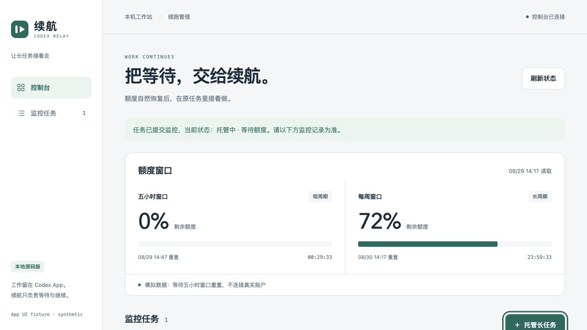
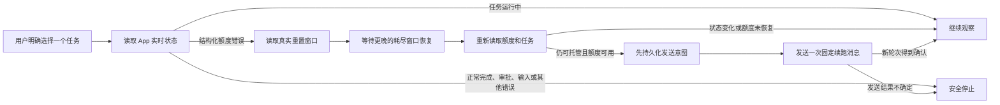

<p align="center">
  
</p>

<h1 align="center">Codex Auto Resume</h1>

<p align="center">
  <strong>额度自然恢复后，让一个明确选择的 Codex 长任务在原对话中继续。</strong>
</p>

<p align="center">
  本地运行、安全优先、不需要服务器的 Codex 桌面 App 配套工具。
</p>

<p align="center">
  <a href="https://github.com/progressrdx/codex-auto-resume/actions/workflows/ci.yml"></a>
  
  
  
  
  <a href="LICENSE"></a>
</p>

<p align="center">
  <a href="README.md">English</a> ·
  <a href="#三步启动">快速开始</a> ·
  <a href="#工作原理">工作原理</a> ·
  <a href="#安全边界">安全边界</a> ·
  <a href="#常见问题">常见问题</a>
</p>

---

长时间运行的 Codex 任务可能因为额度耗尽而中断，即使任务本身还没有完成。本工具只监控一个由用户明确选择的本地任务，等待真实额度窗口自然恢复，重新核验任务状态，然后在原对话中启动下一轮。

它不会切换账号、购买额度、使用重置券、自动批准工具调用、新建替代对话，也不会扫描并接管所有未完成任务。

> [!IMPORTANT]
> 这是非官方实验工具，与 OpenAI 没有关联或背书。项目维护者已经完成两次 macOS 和一次 Windows 11 真实账户跨自然额度重置周期的端到端验证，均成功在原任务中自动确认续跑。测试范围和剩余限制详见[当前验证状态](#当前验证状态)。

## 界面预览

<p align="center">
  
</p>

<p align="center"><sub>截图使用完全隔离的模拟数据，不包含真实账户或对话信息。</sub></p>

## 为什么做这个工具

- **留在原任务**：保留原对话、模型、推理强度、权限和工作目录。
- **纯本地运行**：不需要云服务器、域名、云数据库或本工具账户。
- **一次只管一个任务**：必须由用户明确选择；不能根据标题或“最近任务”猜测授权。
- **遇到风险就停止**：正常完成、等待审批、等待输入、版本不兼容和发送结果不确定都不会继续自动化。
- **持久化保护**：次数预算、取消、进程锁和防重复记录在重启后仍然有效。
- **同时提供界面和命令行**：两种方式使用同一个受保护入口。
- **零运行依赖**：产品只使用 Python 标准库。

## 三步启动

### 环境要求

- macOS，或 Windows 11
- Python 3.9 或更高版本
- 已安装、登录并保持打开的 Codex 桌面 App
- macOS 当前验证版本：`26.820.60940 / build 7119`
- Windows 当前适配版本：App `26.901.31953.0`、CLI `0.153.1`
- 默认路径：macOS `/Applications/ChatGPT.app`；Windows `%LOCALAPPDATA%\OpenAI\Codex\bin\codex.exe`

Windows 版请在 Windows 原生 PowerShell 或命令提示符中运行，不要放到 WSL 里运行。本工具需要连接 Windows Codex App 的本机命名管道。Codex 官方 Windows App 本身支持原生 Windows 和可选 WSL 工作区，但这是两个不同的运行环境。

遇到未验证的 App 版本时，工具会拒绝运行，而不是猜测内部协议。

### 让 Codex 帮你启动（新手推荐）

拉取源码后，在 Codex 桌面 App 中把 `codex-auto-resume` 文件夹作为项目打开，在该项目中新建一个任务，然后把下面这段话发给 Codex：

```text
请先阅读 README.md、README.zh-CN.md、AGENTS.md 和
.agents/skills/codex-auto-resume/SKILL.md。检查本机是否满足运行条件。macOS 使用
./resume，Windows 使用 .\resume.cmd；先运行 doctor，如果只读检查通过，再运行 web，
并保持本机服务运行。
把这次服务输出的准确控制台地址和连接凭据告诉我。在我明确选择一个准确任务前，
不要选择、启动、停止或托管任何 Codex 任务。
```

Codex 可以替你检查环境并启动本机服务。根据你的 Codex 权限设置，它可能会请求执行终端命令；请核对命令，只批准你确认过的项目内操作。

启动成功后，Codex 会把类似下面的输出告诉你：

```text
控制台地址：http://127.0.0.1:8765/
连接凭据：Jr7...本次启动生成的其余随机字符
```

在同一台电脑的浏览器中打开控制台地址，粘贴这段凭据，然后点击“连接”。这个凭据由 `./resume web`（Windows 为 `.\resume.cmd web`）在你的电脑上临时生成，**不是** OpenAI API Key、ChatGPT 密码、Codex 账号令牌或 GitHub Token，也不需要去任何网站或账号设置中申请。

> [!NOTE]
> 每次启动 Web 服务都会生成一个新的随机凭据。它只出现在本次服务的终端输出中，也只在该进程运行期间有效。重新启动 `./resume web` 后，旧凭据立即失效。如果不小心公开了凭据，在服务终端按 `Control-C` 停止，然后重新启动即可更换。

管理界面连接成功后，可以让 Codex 先列出任务，但不托管任何任务：

```text
请执行适合当前系统的 list 命令（macOS：./resume list；Windows：.\resume.cmd list），
列出本地可用的 Codex 任务，但不要托管任何任务，
我会先明确选择一个准确任务。
```

你选定一个准确任务后，先让 Codex 做只读检查。开始托管是另一项操作，需要你明确确认：

```text
请只读检查任务 <任务UUID>，并向我解释检查结果，暂时不要启动监控。
```

如果结果包含 `canMonitor: true`，并且你确定要继续：

```text
请只监控任务 <任务UUID>，使用默认累计续跑次数上限。不要管理其他任务，
也不要替我批准任何请求。
```

你也可以在管理界面中亲自选择并确认同一个任务。无论使用哪种方式，“列出任务”或“只读检查成功”都不等于授权开始托管。

### 手动启动

#### 1. 拉取源码

```bash
git clone https://github.com/progressrdx/codex-auto-resume.git
cd codex-auto-resume
```

#### 2. 只读检查

macOS：

```bash
./resume doctor
```

Windows（PowerShell 或命令提示符）：

```powershell
.\resume.cmd doctor
```

`doctor` 只检查 App 版本、本地连接和额度窗口，不会运行模型、选择任务或发送消息。

#### 3. 启动本机界面

macOS：

```bash
./resume web
```

Windows：

```powershell
.\resume.cmd web
```

终端会输出本机地址和每次启动重新生成的连接凭据。凭据由本机进程在启动时生成，不来自 OpenAI、ChatGPT、Codex 或 GitHub：

```text
控制台地址：http://127.0.0.1:8765/
连接凭据：<本次启动的随机凭据>
```

在同一台电脑的浏览器打开地址并输入凭据。凭据应从正在运行 Web 服务的终端复制，也可以使用 Codex 根据该终端原始输出告诉你的值。服务固定监听 `127.0.0.1`，不会暴露到局域网或公网。

## 使用管理界面

1. 输入 `./resume web` 输出的连接凭据。
2. 查看五小时和每周额度窗口。
3. 点击“托管长任务”，从本地 Codex 对话中选择一个任务。
4. 等待只读检查确认这个准确任务是否具备监控资格。
5. 核对累计续跑次数，默认最多 3 次，然后确认加入托管。
6. 需要取消时点击“停止监控”。

停止监控只取消未来续跑，不会中断 Codex 中已经运行的工作，也无法撤回 App 已经接受的消息。关闭网页或 Web 服务不会停止已经启动的 watcher。

## 命令行使用

下面以 macOS 的 `./resume` 为例。Windows 将每条命令开头替换成 `.\resume.cmd`，其余参数完全相同。

```bash
# 发现本地对话，但不会自动托管。
./resume list

# 只读检查一个准确 UUID。
./resume check <任务UUID>

# 以默认累计上限 3 次启动监控。
./resume start <任务UUID>

# 查看持久化监控记录。
./resume status

# 取消这个任务未来的自动续跑。
./resume stop <任务UUID>
```

明确需要其他累计上限时：

```bash
./resume start <任务UUID> --max-resumes 5
```

如果账户返回多个额度桶，必须明确选择：

```bash
./resume start <任务UUID> --limit-id codex
```

工具不会猜测应该使用哪个额度桶。

## 工作原理



自动续跑文字固定在源码中。Web API 不能提交任意提示词、Shell 命令、App RPC 方法、审批决定或账户操作。

## 什么情况下会续跑

只有最新相关轮次存在结构化 `UsageLimitExceeded` 证据时，watcher 才会等待额度恢复。它不会根据“额度”“继续”“limit”等模糊文本判断失败原因。

以下情况会停止或拒绝托管：

- 本轮正常完成；
- 用户手动中断；
- 空对话或归档对话；
- 等待用户输入或审批；
- 非额度错误；
- App 版本或协议状态不兼容；
- 任务指纹、模型、权限、工作目录或目标变化；
- 已经存在发送结果不确定记录；
- 累计续跑预算已耗尽。

## 安全边界

| 边界 | 实际行为 |
| --- | --- |
| 任务选择 | 只管理一个明确选择的 UUID，不按“最近任务”模糊接管。 |
| App 连接 | 使用已安装 App 及其现有登录，不读取或导出账号令牌。 |
| 审批 | 从不接受或绕过审批、权限和用户输入请求。 |
| 额度 | 只等待账户返回的自然重置时间，不使用重置券或切换账号。 |
| 发送 | 发送前再次核验，并在唯一一次尝试前持久化发送意图。 |
| 不确定结果 | 无法确认是否送达时立即停止，禁止自动重试。 |
| 防重复 | 进程锁和持久账本防止重复 watcher 与重复发送。 |
| 浏览器访问 | 固定 `127.0.0.1`，使用每次启动随机凭据，不开放 CORS。 |
| 本地数据 | 只保存 UUID、指纹、状态、预算、去重标识和简短日志。 |

状态默认保存在 `~/.codex-auto-resume/`，权限仅限当前用户。不会保存完整对话、源码、账号令牌或原始私密查询错误。

## 常用配置

全局选项放在子命令之前，Web 选项放在 `web` 之后。

| 需求 | 示例 |
| --- | --- |
| 更换本机端口 | `./resume web --port 9000` |
| App 位于其他目录 | `./resume --app "/Applications/你的 App.app" web` |
| 使用其他 Codex 目录 | `./resume --home /path/to/.codex web` |
| 使用其他状态目录 | `./resume --state-dir /private/path web` |
| 指定 Python | `PYTHON_BIN=/path/to/python3 ./resume web` |

Windows 自定义路径示例：`.\resume.cmd --app "C:\path\to\codex.exe" web`。通常不需要填写，启动器会使用当前用户的默认 App 路径。

工具故意不提供绑定 `0.0.0.0`、局域网地址或公网地址的选项。

## 更新源码

在安全停点停止准备升级的监控，然后运行：

```bash
git pull
./resume doctor
./resume web
```

Windows 对应命令为 `git pull`、`.\resume.cmd doctor`、`.\resume.cmd web`。

更新源码不会清除已有预算和防重复账本。Web 服务重启会更换浏览器连接凭据，已经运行的 watcher 不会热更新新源码。

## 当前验证状态

已完成本地验证：

- App 版本与本地 IPC 兼容检查；
- 对话和额度窗口的只读读取；
- 隔离的策略、持久化、进程锁、取消和传输测试；
- 带凭据的回环 Web API 和浏览器界面；
- 过期响应、过期会话、重复点击和不确定写操作保护；
- 从仓库外目录调用源码启动器；
- Windows 命名管道、App/CLI 版本保护、后台进程锁和非文件描述符的只读查询路径；
- GitHub Actions 同时在 Windows、macOS 和 Linux 上运行隔离回归。

已在当前支持的 macOS Codex 桌面 App 版本上完成真实账户验证：

- 两次完整成功经历“真实额度耗尽 → 跨自然重置窗口 → 在原任务中自动确认续跑”。

已在 Windows 11 实机和登录 ChatGPT 免费账号的 Codex 桌面 App 上完成验证：

- 一次完整成功经历“真实额度耗尽 → 跨自然重置窗口 → 在原任务中自动确认续跑”。

当前自动化测试：

```text
Python：108 项（本机 107 项通过，1 项 Windows 专用启动器测试跳过）
浏览器 UI：26 项通过
运行时第三方依赖：0
```

剩余限制：

- 未来所有 Codex 桌面 App 版本和内部协议变化；
- 三次真实验证之外的所有账户、机器、休眠/网络条件和任务状态组合；
- 尚未重复覆盖的套餐与平台组合：Windows 本次使用 ChatGPT 免费账号，已有付费套餐额度重置验证在 macOS 完成；控制器读取登录账号返回的重置信息，不硬编码套餐时长；
- 证明某一轮正常结束等同于用户的整体业务目标已经完成。

## 故障排查

<details>
<summary><strong>App 版本不兼容</strong></summary>

内部协议带有严格版本保护，请勿绕过。提交 Issue 时只提供 App 版本、build 和脱敏错误摘要，不要上传令牌、完整对话或私密日志。
</details>

<details>
<summary><strong>管理界面无法连接</strong></summary>

保持 Web 服务进程运行，使用它输出的准确地址和同一次启动生成的凭据。旧服务的凭据会按设计失效。Windows 使用 `.\resume.cmd web`。
</details>

<details>
<summary><strong>任务不能加入托管</strong></summary>

运行 `./resume check <任务UUID>`。已完成、归档、中断、空对话、等待审批或等待输入的任务都不能托管。
</details>

<details>
<summary><strong>出现发送结果不确定</strong></summary>

不要自动重试，也不要通过删除状态目录绕过保护。先在原 Codex 对话和本地状态中人工确认发生了什么。
</details>

<details>
<summary><strong>8765 端口已被占用</strong></summary>

使用其他本机端口，例如 `./resume web --port 9000`。
</details>

## 开发验证

产品和仓库内测试都不需要安装第三方依赖：

```bash
python3 -m unittest discover -s tests -v
python3 -m compileall -q codex_resume
node --test tests/test_ui.cjs
node --check codex_resume/static/app.js
python3 scripts/verify_release.py
```

测试只使用模拟消息、回环 HTTP 和临时数据库，不会向真实任务发送消息。

## 参与贡献

欢迎提交聚焦的问题和 Pull Request。提交 Issue 前请：

- 使用最新 `main` 分支复现；
- 提供 App 版本和命令类别；
- 隐去任务 UUID、对话正文、机器路径、连接凭据和账号信息；
- 不要用真实业务任务演示写入路径问题。

安全相关改动需要增加隔离回归测试，并保留版本保护、取消、预算、防重复以及“不确定就不重试”的规则。

## 常见问题

### 它会绕过 Codex 额度吗？

不会。它只等待账户额度自然恢复，并重新查询真实状态。

### 需要服务器或域名吗？

不需要。所有功能都运行在 Codex 桌面 App 所在的同一台电脑上。

### 关闭终端会停止监控吗？

关闭启动 watcher 的终端不会停止 watcher。关闭 Web 服务只会关闭管理界面。电脑重启后需要重新启动监控。

### 可以自动监控全部未完成任务吗？

不可以。这是明确排除的能力，每个任务都必须由用户单独选择和检查。

### 一轮正常结束能证明整个任务完成吗？

不能。工具只管理轮次续跑，不负责业务验收和最终结果验证。

## 支持项目

如果这个工具对你有帮助：

- ⭐ 给仓库点一个 Star，让更多 Codex 用户看见它。
- 🐛 提交一个带安全复现步骤的 Issue。
- 🔗 分享给经常运行 Codex 长任务的开发者。
- 🧪 为新的 App 版本贡献隔离兼容性测试。

## 开源协议

Codex Auto Resume 使用 [MIT License](LICENSE)。

<p align="center">
  <strong>工作留在 Codex，等待交给本机。</strong>
</p>
